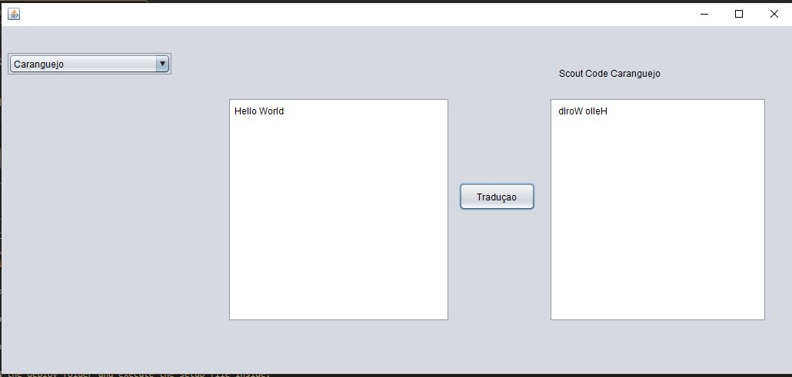

# ScoutCoding

For example, the caragejo code that translates a text backwards 

# Description 

Design of a java tool that allows the translation of 5 scouting languages 

# IT language
-Java
# How to test the code 

Download the deploy folder and execute the setup file inside.
